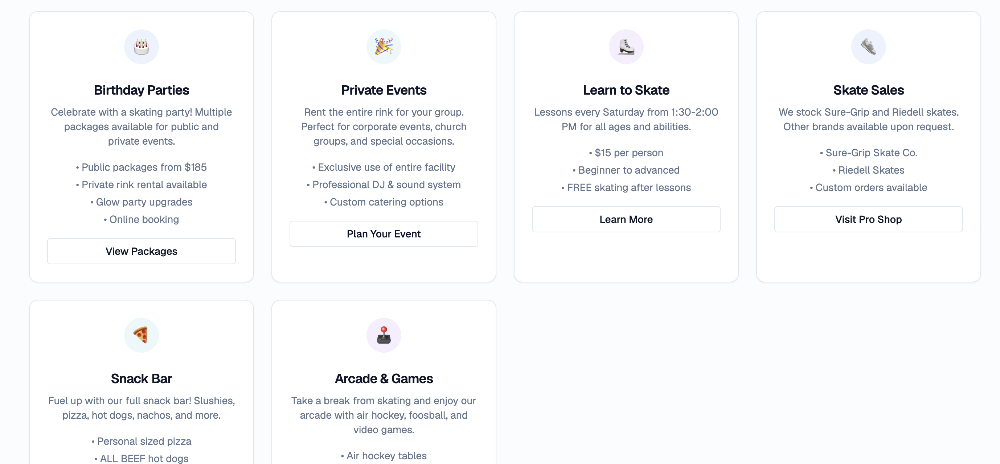

# Content Polish — March 22, 2026

Changes made to align the new Payload CMS site with the old WordPress site content and improve the customer experience.

## Navigation Redesign

**Problem:** New pages (FAQ, Contact, Pricing) weren't reachable from the nav. Learn to Skate took up a header slot but is a niche page.

**Header nav** (hardcoded in `src/lib/constants.ts`):
- Before: Plan Visit, Birthday Parties, Private Events, Learn to Skate, About
- After: Plan Visit, Pricing, Birthday Parties, Private Events, FAQ, About

**Footer nav** (Payload CMS global, updated via API):
- Before: Admin (placeholder)
- After: Plan Visit, Birthday Parties, Learn to Skate, Pricing, Contact

**Why hardcoded header?** The `Header/Nav/index.tsx` component uses `NAVIGATION_ITEMS` from constants instead of the Payload global. The footer correctly uses `getCachedGlobal('footer')`. This is a known architectural decision — header items rarely change and avoiding a DB call keeps it fast.

## Hero Banner Cleanup

**Problem:** The neon "SKATELAND WEST / San Antonio's Premier Family Skating Experience" `heroSection` block repeated on every page, making the experience feel heavy and repetitive.

**Fix:** Removed `heroSection` from all 8 non-home page layouts. Each page still has a Payload `hero: { type: 'lowImpact' }` section that renders the page title — that's sufficient.

Pages updated: Schedule, Birthday Parties, Private Events, Learn to Skate, About, FAQ, Contact, Pricing.

## Price Corrections

**Problem:** Thursday price was $7.34 (typo). Old site shows $7.39. Prices had asterisks with "*Plus State Sales Tax" footnote — confusing for customers.

**Fix:**
- Corrected Thursday from $7.34 to $7.39
- Removed asterisks, changed to "All prices include tax" *comment: We should verify this with the client, but it’s more customer-friendly to include tax in the displayed price rather than showing a lower price with a confusing footnote and then charging more at checkout. If the client insists on showing pre-tax prices, we can re-add the asterisks and footnote, but we should clarify the tax amount to avoid confusion. WE can estimate now by looking up the tax for san antonio, tx and updating the prices to the tax-inclusive amounts. For example, if the tax rate is 8.25%, we would multiply each price by 1.0825 to get the tax-inclusive price. So the Sunday price of $10.16 would become approximately $11.00, and the Thursday price of $7.39 would become approximately $8.00. We can round to the nearest dollar for simplicity, or we can show the exact tax-inclusive price if the client prefers that level of detail. The key is to be consistent.
- Added session times next to each price (e.g., "Sunday (2:00-6:00 PM): $10.16")
- Renamed "Throwback Thursday" to "Family Night Thursday" with $1.00 parent deal info

Updated on: Schedule page, Pricing page, Home page (scheduleCards block), seed data.

## Schedule Page Policies

Added real policies from the old site:
- Saturday after 6 PM: everyone pays
- Thursday Family Night: one parent per child $1.00
- Possible blackout during session (glow items needed)
- Link to Pricing page for full details

## Hyperlinked Page Mentions

**Problem:** Content mentioned pages by name ("Check our Schedule page") but didn't link them.

**Fix:** Added Lexical `link()` helper to `src/endpoints/seed/pages.ts` and used it for:
- Contact page: "Schedule page" links to `/schedule`
- FAQ page: "Private Events page" links to `/private-events`
- Schedule page: "Pricing page" links to `/pricing`

## Promotional Popup

**Problem:** Still showing demo content ("Welcome to Your New Website!").

**Fix:** Updated the `promotional-popup` global via API with Easter Break & Viva Fiesta 2026 content from the old site:
- Easter Break: April 3-6 special hours
- Viva Fiesta: Battle of Flowers April 24, 2:00-10:30 PM
- CTA: "View Full Schedule" linking to /schedule

## Newsletter Signup

**Problem:** Newsletter block was in seed data but not on the live home page (page was created before the block was added, and `createPageIfMissing` skips existing pages).

**Fix:** Added `newsletterSignup` block to home page layout via API. Connected to Listmonk instance on VPS.

## Header Hours Display

**Problem:** Top bar showed static "Open Today: Check Schedule" text.

**Fix:** Added client-side `useEffect` in `Header/Component.client.tsx` to compute today's hours from `SITE_CONFIG.hours` and display them (e.g., "Open Today: 2:00 PM - 6:00 PM" or "Private Parties Only Today").

## Bug Fix: Payload Array Item Rendering

**Problem:** `ServicesCards` and `PartyPackages` components typed their features as `string[]`, but Payload stores array items as `{id, feature}` objects. When page data was restored via API, React threw "object with keys {id, feature}" error.

**Fix:** Updated both components to handle both formats:
```tsx
{typeof feature === 'string' ? feature : feature.feature}
```

## Lesson Learned: depth=0 API Pitfall

When using the Payload REST API to update pages, fetching with `depth=0` strips nested array data (scheduleCards.schedule, servicesCards.cards, partyPackages.packages all become empty arrays). Always use `depth=2` or higher when fetching page data you intend to modify and PATCH back.

## Files Modified

| File | Changes |
|------|---------|
| `src/lib/constants.ts` | Updated NAVIGATION_ITEMS |
| `src/endpoints/seed/index.ts` | Updated footer global seed |
| `src/endpoints/seed/pages.ts` | Added link() helper, removed heroSections, fixed prices, added links |
| `src/Header/Component.client.tsx` | Dynamic today's hours display |
| `src/blocks/ServicesCards/Component.tsx` | Handle {id, feature} objects |
| `src/blocks/PartyPackages/Component.tsx` | Handle {id, feature} objects |
| Live DB (via Payload API) | All page content + popup global |


 - please no emojiis, lets implement an icon library to replace all emojis with consistent icons across the site. This will improve the professional look and feel of the site, and allow us to easily update icons in the future without relying on Unicode emoji support. We can use a popular icon library like Font Awesome, or we can create custom SVG icons that match the Skateland West branding. The key is to ensure that all icons are visually cohesive and enhance the user experience without feeling out of place or inconsistent.